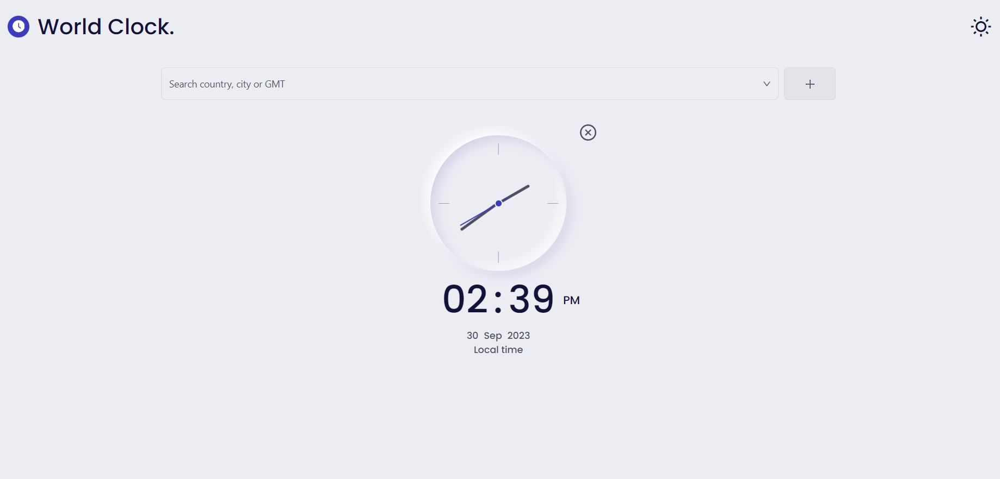

# World Clock

## Description

This is a simple world clock application that allows the user to select a timezone and see the current time in that timezone. The user can also add a timezone to their favorites list and see the current time in their favorite timezones on the home screen. The user can also remove a timezone from their favorites list and search for a timezone by country or city name.

Component Clock have been used in project is forked from [bedimcode/responsive-clock-ui](https://github.com/bedimcode/responsive-clock-ui).

## Features

- [x] Select a timezone and see the current time in that timezone
- [x] Add a timezone to favorites list
- [x] Remove a timezone from favorites list
- [x] Search for a timezone by country or city name
- [x] Auto detect user's timezone
- [x] Light/dark mode toggle
- [x] Auto detect user's system preference for light/dark mode
- [x] Responsive design

## How to run

Project using [Yarn](https://yarnpkg.com/) as package manager and [NodeJS](https://nodejs.org) version 16. Please install yarn and node before running the project.

```bash
$ yarn install
$ yarn start
```

Follow the instructions in the terminal to open the project in the browser.

## Screenshots and demo link

[Demo link](https://worldclocks.vercel.app/)

[](https://worldclocks.vercel.app/)
